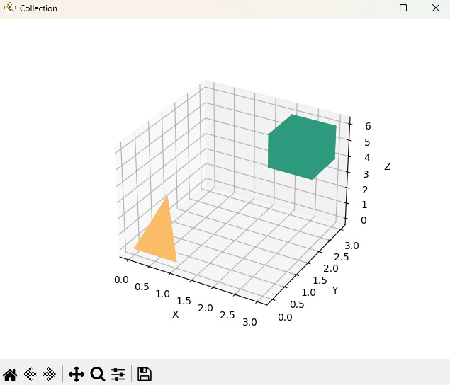

# TKOM_23L - dokmentacja 

Imię i nazwisko     - Grzegorz Socha

Nr indeksu          - 310905

Prowadząca          - Agnieszka Malanowska


## Cel projektu
Projekt polega na realizacji interpretera pewnego języka. Każdy język powinien zawierać, oprócz elementów wymienionych w treści zadania, pewne standardowe elementy omówione na wykładzie (np. typy całkowitoliczbowe i zmiennoprzecinkowe, stałe znakowe, wyrażenia arytmetyczne i logiczne, instrukcję warunkową, pętlę, funkcje itd.)


## Temat projektu

Język umożliwiający opis punktów i odcinków w przestrzeni trójwymiarowej. Punkt i odcinek (zbudowany z punktów) są wbudowanymi typami języka. Z odcinków można budować bryły. Kolekcja brył tworzy scenę wyświetlaną na ekranie.


## Specyfikacja

- Realizacja w języku Python
- Statyczne oraz silne typowanie
- Zmienne mutowalne


## Typy wbudowane
### Typy proste
- `int`
- `float`
- `bool`
- `string`

### Typy złożone
- `List` - Lista pozwalająca na przechowywanie obiektów, zawiera następujące metody:
  - length() - zwraca ilość elementów w liście,
  - get(index) - zwraca element znajdujący się na pozycji index,
  - add(element) - dodaje element na koniec listy,
  - remove(index) - usuwa element znajdujący się na pozycji index, lub ostatni element jeśli index nie został podany,
- `Point` - Typ pozwalający na definiowanie punktu, posiada pola x(float), y(float), z(float) okreslające jego położenie, zawiera następujące metody:
  - set_x(x) - ustawia nową wartość x,
  - set_y(y) - ustawia nową wartość y,
  - set_z(z) - ustawia nową wartość z,
  - get_x() - zwraca wartość x,
  - get_y() - zwraca wartość y,
  - get_z() - zwraca wartość z,
- `Line` - Typ pozwalający na definiowanie odcinka składającego się z dwóch punktów - start(Point) oraz end(Point), zawiera następujące metody:
  - set_start(start) - ustawia nowy punkt start,
  - set_end(end) - ustawia nowy punkt end,
  - length() - zwraca długość odcinka,
  - get_start() - zwraca punkt start,
  - get_end() - zwraca punkt end,
- `Polyhedron` - Typ pozywalający na definiowanie bryły złożonej z n ilości odcinków, warunkiem koniecznym do stworzenia jest połączenie odcinków w jednolitą bryłę tj. każdy punkt składający się na daną bryłę ma min. 3 różnorodne wychodzące z niego odcinki, posiada następujące metody:
  - points() - zwraca listę punktów składających się na bryłę,
  - lines() - zwraca listę odcinków składających się na bryłę,
- `Collection` - Typ pozwalający na definiowanie zbioru brył, który jest wyświetlany na ekranie, zawiera następujące metody:
  - add(Polyhedron) - dodaje bryłę do zbioru,
  - remove(Polyhedron) - usuwa bryłę z zbioru,
  - display() - wyświetla na ekranie rzut 3d zbioru brył,
  - empty() - usuwa wszystkie bryły z zbioru.


## Operatory
- arytmetyczne `+, -, *, /`
- logiczne:
  - relacje `==, !=, >, <, >=, <=`
  - łączniki `or, and`
- przypisania `=`
- dostęp do obiektu `.`
- negacji `-, !`

Dla poszczególnych typów dostepne są następujące operatory:
| Typ          | Operator                              |
|--------------|---------------------------------------|
| int          | `=, +, -, *, /, ==, !=, >, <, >=, <=` |
| float        | `=, +, -, *, /, ==, !=, >, <, >=, <=` |
| bool         | `=, ==, !=, or, and, !`               |
| string       | `=, +, ==, !=`                        |
| List         | `=, +, ==, !=, .`                     |
| Point        | `=, ==, !=, .`                        |
| Line         | `=, ==, !=, .`                        |
| Polyhedron   | `=, ==, !=, .`                        |
| Collection   | `=, ==, !=, .`                        |


## Tworzenie zmiennych
Zmienne proste tworzone będą następująco:

`typ_zmiennej nazwa_zmiennej = wartość zmiennej;`

np.

```
int a = 0;
string temp = "smth";
```


## Komentarze
Komentarze będą tworzone poprzez dodanie # przed tekstem komentarza.


## Instrukcja warunkowe
Struktra instukcji wygląda następująco:

`if (warunek) {} else {}`

np.

```
if (a == 0)
{
    a = 0;
}
else
{
    a = 1;
}
```


## Pętla
Dostępna będzie jedna pętla wyglądająca nastepująco:

`while(warunek) {}`

np.

```
while(a != b)
{
    a = a + 1;
}
```


## Definiowanie funkcji
Każdy wczytany program musi zawierać funkcję `int main()`, która będzie wykonywana.
Funkcje muszą być określone przed funkcją `main` oraz muszą mieć określony typ zwracanej wartości. Funkcje które nie będą zwracać żadnej wartości powinny być typu `void`.

Definiowanie funkcji będzie wyglądało następująco:

`typ_zwracanej_wartości nazwa_funkcji(przekazywane_argumenty) {}`

np.

```
int add(a, b)
{
    return a + b;
}
```


## Przykładowy kod programu

```
# przykładowa funkcja
bool is_vertex(Point a, Polyhedron p)
{
    bool vertex = False;
    int n = p.points().length();
    int i = 0;

    while(i < n)
    {
        if(p.points().get(i).x == a.x and p.points().get(i).y == a.y and p.points().get(i).z == a.z)
        {
            vertex = True;
        }
        i = i + 1;
    }

    return vertex;
}

int main()
{
  # definicja zmiennych
  Point a = Point(0, 0, 0);
  Point b = Point(2, 3, 0);
  Point c = Point(6, 1, 2);
  Point d = Point(4, 7, 5);

  Line ab = Line(a, b);
  Line ac = Line(a, c);
  Line ad = Line(a, d);
  Line bc = Line(b, c);
  Line bd = Line(b, d);
  Line cd = Line(c, d);

  Polyhedron p = Polyhedron(ab, ac, ad, bc, bd, cd);

  Collection scene = Collection();


  # dodanie wielokąta do sceny i wyświetlenie go
  scene.add(p);
  scene.display();


  # wywołanie funkcji oraz wypisanie wartości do konsoli
  bool result = is_vertex(c, p);
  print(result);
}
```


## Funkcje wbudowane
- print - wypisuje linię na wyjście standardowe.


## Gramatyka

```
program                     = {function_declaration} ;

block                       = "{", {statement}, "}" ;

statement                   = assigment | if_statement | while_statement | function_call, ";" | method_call, ";" | return, ";" ;

assignment                  = type, identifier, "=", expression, ";"  | identifier, "=", expression, ";"

if_statement                = "if", "(", expression, ")", block, ["else", block] ;

while_statement             = "while", "(", expression, ")", block ;

function_call               = identifier, "(", [call_parameters_list], ")" ;

method_call                 = identifier, access_operator, identifier, "(", [call_parameters_list], ")" ;

call_parameters_list        = expression, {",", expression} ;

function_declaration        = function_type, identifier, "(", [parameters_list], ")", block ;

parameters_list             = type, identifier, {",", type, identifier} ;

return                      = "return", [expression] ;

expression                  = or_expression ;

or_expression               = and_expression, {or_operator, and_expression} ;

and_expression              = comparative_expression, {and_operator, comparative_expression} ;

comparison_expression       = arithmetic_expression, [comparison_operator, arithmetic_expression] ;

arithmetic_expression       = multiplicative_expression, {arithmetic_operator, multiplicative_expression} ;

multiplicative_expression   = negation_expression, {multiplicative_operator, negation_expression} ;

negation_expression         = [negation_operator], method_call_expression ;

method_call_expression      = factor, {access_operator, identifier, "(", [call_parameters_list], ")"} ;

factor                      = literal | identifier | function_call | "(", expression, ")" ;

arithmetic_operator         = "+" | "-" ;

multiplicative_operator     = "*" | "/" ;

comparison_operator         = "==" | "!=" | ">" | "<" | ">=" | "<=" ;

or_operator                 = "or" ;

and_operator                = "and" ;

negation_operator           = "-" | "!" ;

access_operator             = "." ;

function_type               = "void" | type ;

type                        = "int" | "float" | "bool" | "string" | "Point" | "Line" | "Collection" | "List" ;

identifier                  = letter, {letter | digit } ;

literal                     = int | float | bool | string ;

int                         = "0" | (non_zero_digit, {digit}) ;

float                       = int, ".", digit, {digit} ;

bool                        = "True" | "False" ;

string                      = '"', {char}, '"' ;

char                        = ({letter} | {digit} | {other_symbols}), {char} ;

letter                      = #'[a-z]' | #'[A-Z]' ;

digit                       = "0" | non_zero_digit ;

non_zero_digit              = "1" | "2" | "3" | "4" | "5" | "6" | "7" | "8" | "9" ;

other_symbols               = " " | "." | "," | "!" | "?" | ":" | "/" | "@" | "$" | "%" | "^" | "*" | "-" | "+" | "_" ;
```


## Obsługiwanie błędów
W razie wystąpienia błędu zwracany będzie odpowiedni komunikat. Jeśli będzie to błąd krytyczny to program zostanie przerwany.

Przykładowe komunikaty błędu:

```
InvalidTokenError:
Error occured in line 3, column 4:
Invalid character '^'
```
```
InvalidNumberOfArgumentsError:
Invalid number of arguments:'
Function 'add_variable' called with invalid number of arguments'
```


## Analiza wymagań
- program interpretuje kod z pliku tekstowego lub z ciągu znaków podanego w argumencie wywołania,
- program wyświetla wynik działania programu na konsolę,
- sprawdza poprawność leksykalną i składniową i odpowiednio zgłasza wykryte błędy,
- zapewnia unikalność nazw zmiennych i funkcji,
- sprawdza poprawność tworzonych zmiennych typów złożonych,
- umożliwia na wielokrotne tworzenie oraz wyświetlanie scen zawierających bryły.


## Podział na moduły
Z racji że praca nad projektem była podzielona na 3 iteracje, projekt również został podzielony na 3 moduły:
- Lekser - Moduł realizujacy analizę leksykalną. W jego skład wchodzi `source.py`, `lexer.py` oraz odpowiednie testy do tych modułów zawarte w `test_lexer.py`:
  - `source.py` - Moduł realizujący wczytywanie kodu z pliku tekstowego lub z ciągu znaków podanego w argumencie wywołania,
  - `lexer.py` - Moduł realizujący analizę leksykalną. Tworzy on listę tokenów gotowych do analizy składniowej,
- Parser - Moduł realizujący analizę składniową. W jego skład wchodzi `tokens.py`, `parser.py` oraz odpowiednie testy do tego modułu zawarte w `test_parser.py`:
  - `nodes.py` - Moduł zawierający klasy reprezentujące poszczególne węzły drzewa składniowego,
  - `parser.py` - Moduł realizujący analizę składniową. Tworzy on drzewo składniowe gotowe do interpretacji,
- Interpreter - Moduł realizujacy interpretację analizowanego kodu. W jego skład wchodzi `classes.py`, `context.py`, `visitor.py`, `interpreter.py` oraz odpowiednie testy do tych modułów zawarte w `test_interpreter.py`:
  - `classes.py` - Moduł zawierający klasy reprezentujące poszczególne typy danych złożonych, które są wykorzystywane w trakcie interpretacji,
  - `context.py` - Moduł zawierający klasę reprezentującą kontekst interpretacji, który przechowuje zmienne i funkcje,
  - `visitor.py` - Moduł zawierający klasę reprezentującą wizytatora drzewa składniowego, który przekształca drzewo składniowe na drzewo interpretacji,
  - `interpreter.py` - Moduł realizujący interpretację analizowanego kodu. Wykonuje on dostarczony kod i zwraca wynik.

Dodatkowo w pliku `errors.py` zawarte są klasy reprezentujące błędy, które mogą wystąpić w trakcie analizy leksykalnej, składniowej oraz interpretacji, a w pliku `main.py` zawarta jest funkcja `main`, która jest odpowiedzialna za uruchomienie programu.


## Uruchomienie programu
Aby uruchomić program należy wywołać skrypt `main.py` z odpowiednimi argumentami:
- `-f` uruchomienie interpretacji z pliku tekstowego zawierający kod,
- `-s` uruchomienie interpretacji z podanego ciągu znaków.

Przykładowe uruchomienie programu z pliku tekstowego:
```
python3 main.py -f ./tests/test_cases/figures.txt
```

Przykładowe uruchomienie programu z ciągu znaków:
```
python3 main.py -s 'int main() {print("eh"); return 0;}'
```


## Przykładowe wyświetlenie sceny



## Testowanie

Jak już wcześniej wspomniano, każdy z poszczególnych modułów posiada testy jednostkowe zrealizowane za pomocą biblioteki `pytest`. Plki z testami znajdują się w folderze `tests`. Dodatkowo w podfolderze `test_cases` znajdują się pliki tekstowe zawierające przykładowy kod, który został wykorzystany do testowania programu.


## Biblioteki

Do oblicznia i wyświetlania brył na ekranie zostały wykorzystane następujące biblioteki:
- `numpy`
- `matplotlib`
- `scipy`

Wszyskie pozostałe wykorzystane biblioteki są bibliotekami standardowymi języka Python.

Wymagane dodatkowe biblioteki do uruchomienia programu wraz z odpowiednimi wersjami zostały umieszczone w pliku `requirements.txt`.
